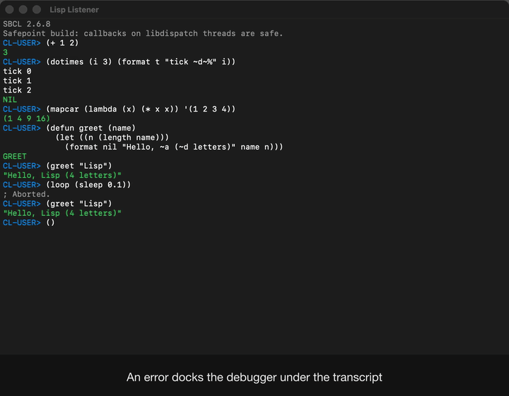
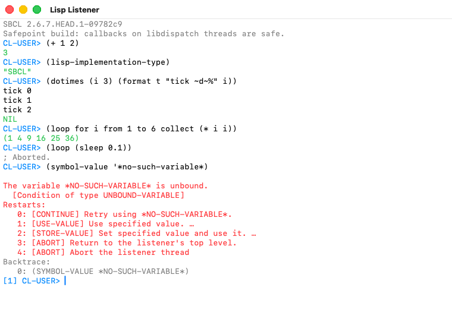
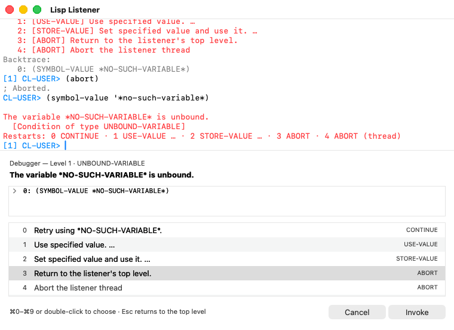
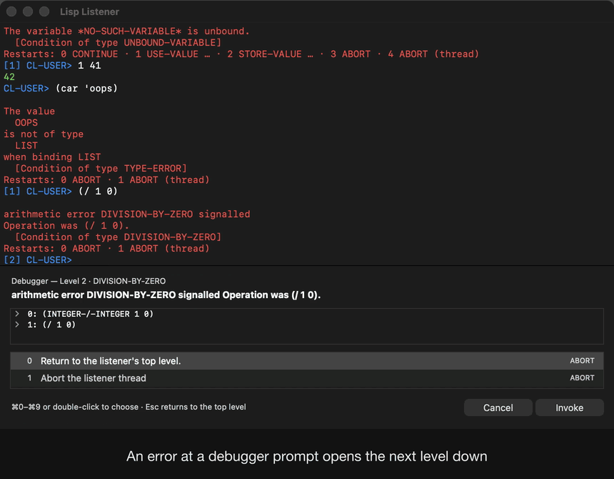
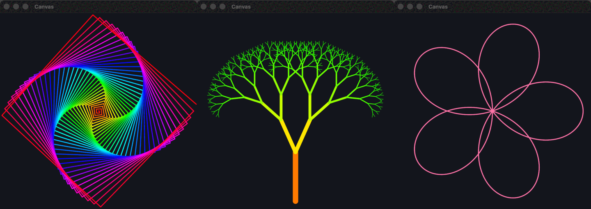
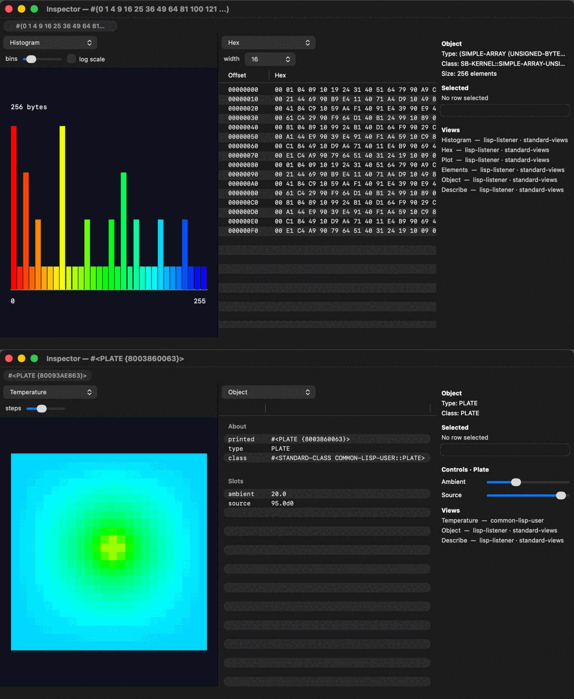
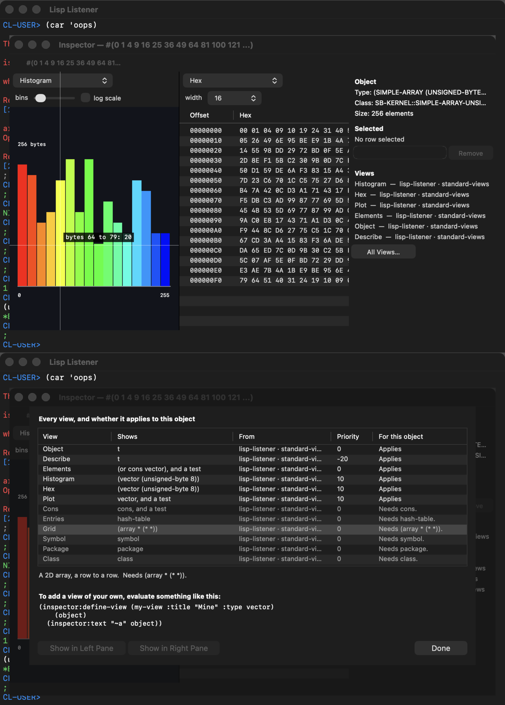
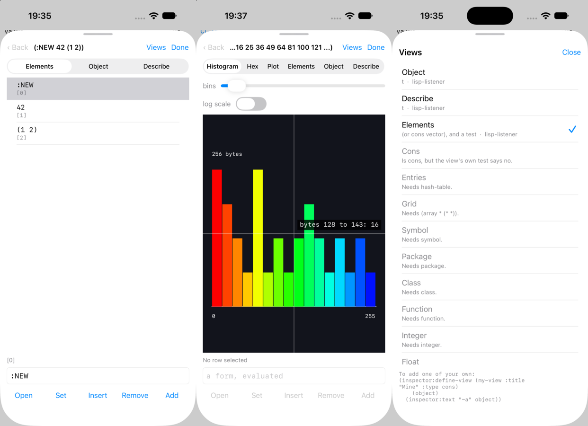

# Lisp Listener

A Lisp Listener in a native window: AppKit and SBCL on macOS, UIKit and ECL on
iOS.

Not a REPL in a terminal and not an editor with a REPL pane: a window you type
forms into, with the values, the output and the debugger coming back in the
same transcript — what LispWorks calls a Listener. Every Objective-C class in
it is defined from Lisp, through
[lispnik/objc](https://github.com/lispnik/objc), and it ships as a signed
`.app` built by
[lispnik/asdf-macos-app](https://github.com/lispnik/asdf-macos-app).

```lisp
(asdf:load-system "lisp-listener")
(lisp-listener:run-listener)
```



**[The whole demo](https://github.com/lispnik/lisp-listener-app/releases/latest/download/lisp-listener-demo.mp4)**
(a minute, captioned): typing, paredit, Option-Return, ⌘. and ⌘R, then the
debugger. Made by `make demo`, which plays the session in the real window a key
at a time and photographs it -- not a screen recording.

**[Download the app](https://github.com/lispnik/lisp-listener-app/releases/latest)**
for Apple silicon or Intel: SBCL is inside it, and nothing else is needed.


The debugger prints the condition and a numbered restart list, and the prompt
becomes `[1] CL-USER>`. Type a number to take a restart, or any form to evaluate
it at that level.



The same restarts open in a pane docked under the transcript, after the
LispWorks notifier: the restarts themselves, in the order `compute-restarts`
gives them — so whatever a handler established shows up, rather than a fixed
set of buttons — each as its report, with its number and name set back. It
opens on the restart that returns to the top level. Double-click a row, select
it and press Invoke, or press **⌘ and its number**. Cancel — and Escape, from
the prompt — returns you to the top level. The divider moves, and the pane goes
when the debugger level does.



Above the restarts is the **backtrace**, which is the other half of what the
LispWorks Debugger tool shows: the restarts say what you can do, the frames say
where you are. On SBCL each frame opens to show its local variables as they
were when it failed. The listener's own frames are cut, and so are the
evaluator's under your code, and `lisp-listener:*backtrace-frames*` sets the
depth.

It is an **addition**. The prompt still takes a number — or a number and a
form, `1 42`, for a restart that wants a value — and the keyboard stays at the
prompt while the pane is up. The transcript keeps the condition and a line of
what each number means, `Restarts: 0 CONTINUE · 1 USE-VALUE … · 3 ABORT`, and
leaves the full list and the frames to the pane; with the pane switched off it
prints them all.
Choosing a restart *types its number for you*, where you can see it: a restart
has to be invoked on the listener thread, inside the dynamic extent of the
debugger that established it, and that thread is already sitting in
`read-line` waiting for exactly this answer. So there is one mechanism with two
doors, not two mechanisms. Set `lisp-listener:*restarts-panel-enabled*` to
`nil` for the transcript alone.

**New Listener (⌘N)**, in the Listener menu, opens another one. Each window has
its own thread, its own input queue and its own transcript, and they share only
the image they evaluate in — so a form that never returns in one leaves the
others typing, and a window sitting at `[1] CL-USER>` in its debugger leaves the
others at their own top level. Closing a window ends that listener alone; the
application goes when the last one does.

Evaluation is on another thread, so a form that never returns leaves the window
responsive, and Interrupt (⌘.) gets the prompt back.


These pictures are not staged. `src/macos/screenshot.lisp` drives a real listener and
photographs it, and `.github/workflows/macos.yml` runs it on every push — so
they are always a picture of the current code, taken on a GitHub macOS runner.

The capture asks the window's frame view to draw itself into a bitmap, which
is why the title bar is in the picture and why no Screen Recording permission
is involved: nothing is photographed off the screen.

### Typing

- **Parens and quotes close themselves**, and typing the closer steps over the
  one already there; the paren at the caret and its partner are tinted, red
  when it has none. The structural commands are Emacs paredit's — `C-)` slurp,
  `C-}` barf, `M-(` wrap, `M-s` splice, `C-k` kill, `C-M-f`/`C-M-b` move — and
  `(setf (lisp-listener:paredit-key "C-(") 'slurp-backward)` rebinds, in
  `init.lisp` if it should last.
- **Return evaluates; Option-Return starts a new line**, indented the way Lisp
  is indented: a body two in, a call under its first argument. Whether an
  operator takes a body is asked of the running image, so your own macros
  indent too.
- **Tab** completes the symbol before the caret, from the listener's package.
- **What a call takes** is shown as you type it: with the caret in
  `(mapcar #'1+ `, the window's title says `(mapcar function ‹list› &rest
  more-lists)`, the argument the caret is on marked; on iOS it is the line over
  the keys, that argument in bold. It is asked of the running image, so a
  function you defined a moment ago is described too. Settings can switch it off.
- **C-a**, Home and ⌘← go to the start of the line, which is after the prompt.
- **↑ and ↓** walk the history, and **⌘R** searches all of it: type to narrow,
  and the form you choose goes back at the prompt to edit. The history is kept
  between launches.

### A canvas, and some examples



There is a canvas to draw on. `(circle 0 0 50)` at the prompt opens it — a
second window on the Mac, a pane beside the transcript on an iPad, a sheet on a
phone — and draws a circle in the middle: the canvas runs from -100 to 100 each
way, with y going up.



```lisp
(dotimes (i 140)            ; the spiral
  (hue (/ i 140))
  (forward i)
  (right 89))

(plot (lambda (x) (* 50 (sin (/ x 10)))))
```

| | |
|---|---|
| shapes | `line` `dot` `circle` `rect` `box` `text`, and `plot` and `curve` for a function |
| the pen | `color` (`:red`, or three numbers), `hue` for the rainbow, `pen` for the width |
| a turtle | `forward` `back` `left` `right` `pen-up` `pen-down` `home` `move-to` |
| animation | `(frame ...)` draws one whole picture in place of the last, and `(wait 0.1)` pauses |
| games | `(key)` answers the next key pressed in the canvas — `:left`, `:space`, `#\q` — or `nil` |
| the mouse, or a finger | `(pointer)` answers where it is and whether it is down — a mouse is followed with its button up, too — and a press is also the key `:click` |
| the canvas | `clear` `background` `show` `hide`, and `(save "name.png")` or `"name.svg"` to keep it |

They are ordinary functions in a package called `canvas`, imported into
`cl-user` when a listener starts, and each has a docstring.

Thirteen short programs come with it, in the **Examples** menu (the **Try** key
on a phone): a face, the spiral, a rose curve, a tree made of smaller trees,
Sierpinski's triangle from a coin with three sides, the Mandelbrot set, a
clock, bouncing balls, Conway's Life, a doodle to draw with the mouse or a
finger, Snake, Pong, and a hot plate that teaches the inspector a view of its
own. `(examples)` lists them, `(example "snake")` runs one,
`(example-source "snake")` prints it to read — none is longer than a screen —
and `(example-edit "snake")` puts it at the prompt to change. Running one
leaves what it defined, so after the spiral there is a `spiral` to call with an
angle of your own: `(spiral 121)`.

Drawing happens on the listener thread and only ever makes a list; thread 1
paints it. So a drawing that goes wrong lands in the debugger like any other
error, Interrupt stops an animation, and `make test` runs every example with
no window anywhere.

### An inspector you can teach



`(inspect x)` opens an inspector on `x`. So does **Listener ▸ Inspect** (⌘I),
on the last value; a click on any value printed in the transcript; and a
double click on a local in the debugger's frames.

It shows two **views** of the thing side by side, chosen from every view that
applies: a byte vector opens as a histogram beside its hex, a 2D array of
floats as a heat map beside a surface, an instance as its slots. A double click
on a row walks into that value, and the path across the top leads back.
Select a row and the panel on the right has a field to change it — a form,
evaluated — which the place refuses if it cannot hold the result: a byte
vector will not take 999. In a grid the cell changed is the one clicked.
**Remove** unbinds a slot, drops a hash table's key, or takes an element out of
a list or a vector that can grow; and where the object can be added to there
are fields for it: a key and a value for a hash table, a value for a list or
such a vector, with **Insert Before Selected** to put it in the middle. A list
is changed in place, so it is still the list you were looking at.

Hold the pointer over a drawing and it says what is under it: the bin of a
histogram and how many bytes fell in it, the cell of a heat map and its value.
**All Views…** lists every view there is, the ones that do not apply included,
each saying what it wanted — `needs (vector (unsigned-byte 8))` — and what to
type to add one of your own. A view that never finishes is stopped after five
seconds (`lisp-listener::*inspector-time-limit*`) and its pane says so; the
rest of the inspector carries on.



**Anyone can contribute a view.** A view is matched by a type and, if that is
not enough, a predicate; it is given the object and answers a *scene* — a
table, some text, or a drawing made with the canvas's own functions. It draws
nothing itself, which is why the same view is a picture in a window, text in a
transcript, and something `make test` can check.

```lisp
(inspector:define-view (histogram
                        :title "Histogram"
                        :type (vector (unsigned-byte 8))
                        :options ((bins 32 :integer :min 4 :max 256)))
    (bytes &key bins)
  (inspector:drawing ()
    ...                       ; LINE, BOX, HUE: the canvas's functions
    ))
```

Options — `bins` — are the view's own, and get a control above the view.
**Controls** belong to the object: `inspector:define-controls` contributes
sliders, fields, toggles and buttons bound to *places*, and moving one changes
the object and redraws every view of it. `(example "thermal")` is the whole
thing in forty lines: a hot plate, a view that shows the heat spreading, and
two sliders that change it.

A drawing can say what is under the pointer: give `inspector:drawing` a
`:readout`, a function of a point on it answering a string.

**Objective-C objects** are inspected too, once somebody says that is what they
are. A foreign pointer is shown as an address and asked nothing, because asking
a pointer that is not an object is a crash; its view has a button, *Treat as
Objective-C object*, and `(inspect (inspector:objc pointer))` says the same at
the prompt. Then it has its class and its description, an `NSArray` its
elements and an `NSDictionary` its entries, each one walked into in turn. A
view for a class of your own is matched by `:objc-class`, runs on the main
thread, and may answer a view of the toolkit's own:

```lisp
(inspector:define-view (image-view :title "Image" :objc-class "NSImage"
                                   :requires (:appkit))
    (image)
  (inspector:native
   (lambda () (make-my-image-view (inspector:objc-pointer image)))
   :fallback (inspector:text "An image.")))
```

An `NSImage`, an `NSView` and an `NSWindow` come with pictures that way, and a
window with a slider for its opacity.

`(inspector:views x)` lists the views that apply, and `(inspector:show x
"Hex")` prints one as text.

**On iOS** the inspector is a sheet with one pane: the views across the top,
the view's options and the object's controls under them, and at the foot the
selected row with a field and Open, Set, Insert, Remove and Add. A finger on a
drawing is the pointer, **Views** lists every view and why the ones that do
not apply do not, and a tap on a value printed in the transcript opens the
inspector on it (while the keyboard is up, so that the tap which raises the
keyboard does not).



### Settings

**Settings…** (⌘,) has the switches worth a checkbox — paredit, the paren tint,
the indenter, the docked debugger, whether to reopen windows — and the size of
the type, which **View ▸ Bigger** (⌘+) and **Smaller** (⌘-) also change. Each
takes effect at once and is kept, in `preferences.lisp-expr` beside the
history; `(setf (lisp-listener:preference :font-size) 16)` is the same thing
from the prompt. `init.lisp` is loaded afterwards and so has the last word.

**Edit init.lisp…** opens that file, made first with a few lines saying what
it is for: in your editor for `.lisp` files on the Mac, or TextEdit if nothing
claims them; and on iOS in an editor of its own in Settings, whose **Save and
Load** loads it at the prompt so that it is in force at once.
`(lisp-listener:init-file)` answers where it is.

### Files from the network

`(download url)` fetches a file and answers where it put it: in `~/Downloads`
on the Mac, in the app's own folder on iOS, or wherever a second argument says.

```lisp
(download "https://example.com/lib/thing.lisp")
(load *)
```

Only `https://` addresses are fetched — the system refuses plain `http://` —
and the listener waits while it fetches.

The application remembers its windows: quit with two listeners and the canvas
open, and that is what comes back, where they were.

### Editing files

**On the Mac, the editor is [heml](https://github.com/lispnik/heml)**, an
Emacs-style editor written in Common Lisp, running inside the listener's own
application: one more window, with heml's menus while it is in front.
`(ed "file.lisp")` opens a file in it, `(ed 'name)` opens the file a definition
is in at its line, and **File ▸ Show Editor** (⇧⌘E), **Open in Editor…** (⇧⌘O)
and **Listener ▸ Edit Definition** (⌘E, the symbol at the caret) do the same
from the menus. heml's own evaluation commands — `C-M-x`, `C-x C-e`, Evaluate
Region, Load File — **evaluate at the listener's prompt**: the transcript shows
each form, an error opens the listener's debugger, and the history keeps it,
read in the package of heml's buffer. Closing heml's window puts it away with
its buffers kept; quitting the application asks heml first, which offers to
save what it has changed.

**On iOS the editor is built in**, from the listener's own editing — paredit,
the indenter, completion, the paren tint and what a call takes. **Edit** on the
key bar opens it on the file you last edited, or on `scratch.lisp`; **Open…**
picks another, and Settings ▸ Edit opens `init.lisp`. Return indents rather than
submitting; the keys over the keyboard are Tab, the arrows, **Eval** (the form
at the caret, at the prompt — what it said shows over the editor), **Load**,
**Save** and **Close**, and a keyboard has ⌘E, ⌘L, ⌘S and ⌘W. A form is read
in the package of the file's last `(in-package …)`, and the file is saved when
the editor closes or opens another.

## Requirements

- macOS on arm64 or Intel.
- **An SBCL built `--with-sb-safepoint`.** See below.
- The Lisp dependencies, which [ocicl](https://github.com/ocicl/ocicl) will
  fetch for you.

## Dependencies, with ocicl

```sh
ocicl setup        # once per machine
make deps          # or: ocicl install
```

That is the whole of it: `ocicl install` reads `ocicl.csv` and restores
everything into `./ocicl/`, which `ocicl setup` has already put on ASDF's
source registry. **No sibling checkouts are needed** —
[`objc`](https://github.com/lispnik/objc) and
[`asdf-macos-app`](https://github.com/lispnik/asdf-macos-app) are themselves
published to ocicl, so a fresh clone plus the two commands above is enough to
`(asdf:load-system "lisp-listener")`.

**The application also needs heml**, which is not on ocicl: a checkout of
[heml](https://github.com/lispnik/heml) on the source registry, its own
dependencies restored there (`git submodule update --init && ocicl install` in
it), and `brew install libfixposix` for iolib. Then `(asdf:load-system
"lisp-listener/heml")` and `make app`. The listener without the editor needs
none of it.

`ocicl.csv` is a **lockfile**, and it is committed. Every row names its package
by digest:

```
objc, ghcr.io/ocicl/objc@sha256:3a99872f…, objc-20260918-a217b78/objc.asd
```

A digest is the content, not a label that can be re-cut, so `ocicl install`
restores the same 13 packages — 26 system definitions between them — on every
machine and in every CI run. The restored
sources are *not* committed — `/ocicl/` is gitignored — because the lockfile is
what pins them.

If you would rather work against a checkout of `objc` — which is what this
repository's own CI does, so that a break in objc's `master` shows up here
before it is published — put it on `CL_SOURCE_REGISTRY` ahead of `./ocicl/` and
it will shadow the pinned copy.

## Why a safepoint build

On macOS, a garbage collection that happens while two or more libdispatch
worker threads are inside Lisp kills the process outright:

```
fatal error encountered in SBCL: cannot suspend thread 0x...: 45, Operation not supported
```

No condition, no backtrace, nothing a handler can see. `stop_the_world`
suspends every other thread with `pthread_kill`, and **Darwin refuses to signal
a libdispatch workqueue thread at all** — measured at `ENOTSUP` even for signal
0. Building `--with-sb-safepoint` stops the world by polling instead, and the
problem goes away entirely; the worker is still unsignallable there, which is
the proof that the mechanism rather than the platform changed. lispnik/objc's
[`doc/sbcl-libdispatch-safepoint.md`](https://github.com/lispnik/objc/blob/main/doc/sbcl-libdispatch-safepoint.md)
is the full report, with a self-contained reproducer.

This program uses no GCD of its own. It asks for a safepoint build anyway,
because AppKit reaches libdispatch on its own account and because a listener is
by construction long-lived, hard-consing and multi-threaded — the program most
likely to find that window. It starts on a stock build and says so in the
transcript rather than refusing.

```sh
./make.sh --with-sb-safepoint --prefix=$HOME/.local && sh install.sh
```

If the contrib build dies at `sb-manual`, a source registry containing any ASDF
or UIOP *source* is why — the contrib build calls `upgrade-asdf` and finds it.
Build with `CL_SOURCE_REGISTRY="(:source-registry :ignore-inherited-configuration)"`.

Check a build really has it:

```sh
sbcl --noinform --non-interactive \
     --eval '(print (and (member :sb-safepoint *features*) t))'
```

## Building the application

```sh
make app          # => build/Lisp Listener.app
open "build/Lisp Listener.app"
```

**Run `make app` with the safepoint SBCL itself.** `asdf-macos-app` copies the
runtime of whichever SBCL performs the build into `Contents/MacOS/`, so
building from a stock one pairs a stock runtime with this core and hands back
exactly the fragility the safepoint build exists to remove.

Set `MACOS_SIGNING_IDENTITY` to a Developer ID certificate name to sign for
distribution. Unset, the bundle is signed ad hoc, which runs on the machine
that built it and nowhere else.

### Checking the built app from a shell

```sh
LISP_LISTENER_SELFTEST=/tmp/listener.png \
  "build/Lisp Listener.app/Contents/MacOS/lisp-listener"
```

It evaluates `(+ 1 2)`, waits for the value to appear in the transcript — with
a bound, rather than sleeping and hoping — writes the window to that PNG, and
quits. The result goes to the bundle's log.

## On iOS

The same listener runs on an iPhone or an iPad, on
[ECL](https://ecl.common-lisp.dev/) rather than SBCL, built by
[lispnik/asdf-ios-app](https://github.com/lispnik/asdf-ios-app). One core, two
front ends: everything that is not a view -- the reader, the evaluator, the
debugger, paredit, indentation, completion, the history -- is the same code.

```sh
make ios-toolchain  # once: asdf-ios-app builds the host and iOS ECLs (~10 min)
make ios            # => build/iphonesimulator/Lisp Listener.app
make run-ios        # build, install and launch in the booted simulator
```

The transcript is a `UITextView`. Above the on-screen keyboard is a bar of the
keys a phone keyboard lacks -- Tab, Esc, ↑ and ↓, Hist, Try, Open, Clear, Stop
and ⚙ for Settings -- and with a hardware keyboard the same keys work as they do on the Mac:
Tab completes, ↑ and ↓ walk the history, Option-Return indents a new line, ⌘.
stops a form, ⌘K clears, ⌘R searches the history, ⌘O opens a file, ⌘, is
Settings, and ⌘+ and ⌘- change the size of the type.

An error brings up the restarts as a **sheet**: each restart's report, its
number and name under it, and the frames below. Tap a row, or press ⌘ and its
number. A restart that wants a value asks for it in the sheet, and Cancel
returns to the top level.

A `.lisp` file in the Files app, or in a share sheet, offers **Lisp Listener**:
opening it loads it, with the `(load "…")` typed at the prompt as File ▸ Open…
does on the Mac. **Open** on the key bar is the same thing from inside: the
system's document picker. The app's own folder is in Files under On My iPhone,
so a file put there is `(load "name.lisp")` away, and a picture saved with
`(save "name.png")` or a file fetched with `(download url)` is there to share.
That folder is home, too: a relative pathname, and `~/`, both mean it.

**Libraries load with ASDF.** Put a system's directory in the app's folder
under `common-lisp/` — from the Files app, or with `(download …)` — and
`(asdf:load-system "name")` finds it and what it depends on, each of which has
to be there too. It is compiled once, to ECL's bytecode (a phone has no C
compiler), into a hidden `.cache` in the same folder, and loaded from there
afterwards. Bytecode is slower than the app's own compiled code, so a library
is fine for convenience and less so for a tight loop.

`(inspect (inspector:objc (uikit:key-window)))` inspects the window itself: a
picture of it as it is drawn, and its subviews, each one to walk into and see.

The canvas goes where there is room for it. On an iPad, or a big phone on its
side, it is **docked** beside the transcript, which keeps the keyboard: type a
form and watch what it draws. On a phone it is a sheet at half height, so the
transcript stays in view, and it moves from one to the other if the window's
width changes under it. Either way it takes a finger -- `(pointer)` -- and
has a row of arrows under it for the keys a game reads. **Try** lists the
examples, and **⚙** is Settings: the same switches as on the Mac, and the size
of the type.

The app checks itself: `SIMCTL_CHILD_LISP_LISTENER_SELF_TEST=4 xcrun simctl
launch <device> org.lispnik.lisp-listener` drives a session through typing,
paredit, completion, the history, an error, the sheet, a value, an example, a
game of snake, a picture saved, a file opened and a form that never returns, holding four seconds on each screen worth a look, and writes
`selftest: PASS` to `Documents/console.log` in the app's container.
`make test-ios` does that in an iPhone simulator and an iPad one and reports
both, and `make ios-demo` records it in each as a captioned video: the iPad is not a big phone, and has shown a crash the iPhone never did.

## How it works

Two threads per listener, and the split is the whole design.

**Thread 1** owns AppKit and ends up in `-[NSApplication run]`. Every message
to a view, a window or the text storage happens there. **The listener thread**
is an ordinary SBCL thread running read-eval-print; it touches only Lisp state.
So a form that takes a minute, or loops forever, never freezes the window — and
⌘. gets the prompt back.

With more than one window open there is one thread 1 and one listener thread
each. `lisp-listener:*listeners*` is the live set; `*listener*` names whichever
one the code running at that moment speaks for, and it is **bound** rather than
assigned — each view's Objective-C methods bind it to the listener whose view it
is, and each listener thread to its own. A menu command instead asks for the key
window's, through `current-listener`, because a menu item's action arrives
saying nothing about which window it came from.

They meet at two queues. Characters go main → listener, and the listener's
`*standard-input*` blocks on that queue. Closures go listener → main, drained
by an Objective-C method on the view that
`-performSelectorOnMainThread:withObject:waitUntilDone:modes:` delivers.

Because `read` simply blocks on an incomplete form, there is no Lisp parser in
the view: Return always submits, and if the form is not finished no new prompt
appears and you carry on typing. That is what a terminal REPL does, and it
falls out of the design rather than being arranged.

The transcript is one `NSTextView`. The boundary between what you may edit and
what you may not is a single integer, `input-start`; the view is its own
delegate and refuses any change beginning before it. Output arriving from the
listener thread is inserted **at** `input-start` rather than appended at the
end — otherwise a `format` from a computation still running would be spliced
into the middle of the line you are typing.

`*standard-input*`, `*standard-output*`, `*query-io*` and the rest are all
bound to the window, so `(read-line)` in your own code reads from it, and a
restart that needs a value asks for it there.

### Restarts that ask

Some restarts do not finish the job when you take them; they need a value.
`use-value` and `store-value` carry an *interactive function*, which asks for a
form and evaluates it. The pane and the transcript both mark them with an
ellipsis:

```
0  Retry using *MISSING*.                      CONTINUE
1  Use specified value. …                      USE-VALUE
2  Set specified value and use it. …           STORE-VALUE
3  Return to the listener's top level.         ABORT
```

The ellipsis is the Mac convention for a control that opens a prompt rather
than acting, and it is read from the restart itself, so it appears for anything
a handler established with an `:interactive` clause, not for a fixed list.

Choosing one opens a field in the pane for the form. Return types `1 42` at the
prompt: the debugger reads a number followed by a form as that restart with
that value, so you can type it that way yourself too. A number alone still
takes the restart and lets it ask in the transcript.

`y-or-n-p` and `yes-or-no-p` converse in the window for the same reason.

### The debugger

An error prints the condition and a numbered list of restarts, and the prompt
becomes `[1] CL-USER>`. Type a number to take that restart, or any form to
evaluate it at that level — a debugger level is a working listener. Nesting
works; ⌘. returns to the top.

## Development

```sh
make deps           # restore the pinned dependencies into ./ocicl/
make check          # all three of the checks below, in about three seconds
make syntax-check   # does it parse?
make compile-check  # does it compile?
make test           # does the listener work?
```

The three checks need no dependencies at all — they run against
`tools/stubs/`, so `make check` works in a fresh clone before `make deps`.

All three run anywhere, Linux included, and that is the point: this system
cannot be *loaded* off macOS, because lispnik/objc opens libobjc as soon as it
initializes. `syntax-check` reads every form with `*read-suppress*` bound, so
the reader checks structure without consulting a package. `compile-check`
compiles `src/` against `tools/stubs/`, which supplies exactly the names `src/`
uses, so the compiler reports undefined functions, wrong argument counts and
macros that will not expand.

`make test` is the interesting one, because only *half* of this program is
Cocoa. `tools/headless-test.lisp` starts a real listener on those same stubs —
a real thread, the real gray streams, the real reader, evaluator, printer and
debugger — and drives it through a session, an error, `use-value`,
`store-value`, `y-or-n-p` and an abort, reading the transcript back and
asserting on it. It draws on the canvas and runs every example, too. The seam that makes it possible is `schedule-flush`, which
declines to do anything while there is no main thread to flush to, so the
output simply piles up in the stream where the test can read it.

It earns its place. The `stream-line-column` method on the *input* stream
exists because this harness found, in seconds, that `fresh-line` on a two-way
stream asks the input half for its column — which had quietly broken every
restart that prompts, and `y-or-n-p` with them, through three rounds of CI
screenshots that all looked fine. Delete that method and three cases go red.

What it does **not** cover is anything with a window in it: the view, the
panel, the table, the screenshots are all stubs here. Only a Mac does that —
which is what `.github/workflows/macos.yml` is for: it builds SBCL
`--with-sb-safepoint`, verifies the build really has them, runs the listener's
self-test, builds `Lisp Listener.app` and runs the bundle's self-test, on both
arm64 and Intel. `.github/workflows/check.yml` runs the three above on Linux in
seconds, and `.github/workflows/ios.yml` cross-compiles the iOS app with ECL
and runs its self-test in an iPhone and an iPad simulator.

If you change any of the three, break something on purpose and confirm it goes
red — "no offenders" is also what an empty scan says.

## Known limits

- **`SBCL_HOME`.** A bundle launched from a shell that exports it — Homebrew's
  `sbcl` wrapper does — loads the wrong core and drops into a plain REPL.
  `env -u SBCL_HOME` is the workaround.
- Interrupting with ⌘. a form that is blocked inside a foreign call takes
  effect when the call returns, which is the ordinary SBCL caveat.
- On iOS, a library loaded with ASDF runs as bytecode: there is no compiler to
  native code on a phone.

## Privacy

Nothing you type leaves your device, and nothing reaches the network unless
you ask: `(download url)` fetches the address it is given and sends nothing of
yours. [PRIVACY.md](PRIVACY.md) says what is kept on the device, and where.

## Licence

MIT.
